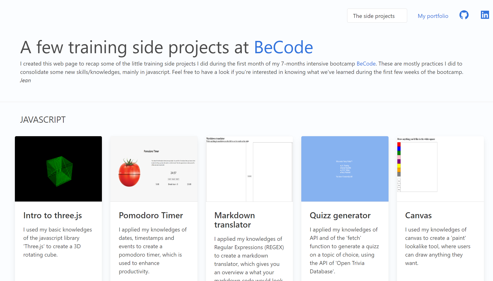

# BeCode side training projects
done by [Jean Fabry](https://github.com/JeanFabry)

## What is this ?
I created a web page which recaps most of the training side projects I did during the first month of my 7-months intensive bootcamp @[BeCode](https://becode.org/). 
These are mostly practices I did to consolidate some new skills/knowledges, mostly in javascript. Feel free to have a deeper look in this repository, or get an overview from the webpage, if you're interested in knowing what we've learned during the first few weeks of the bootcamp.

## Languages used?
* Javascript
* HTML
* CSS
    
## Overview 

