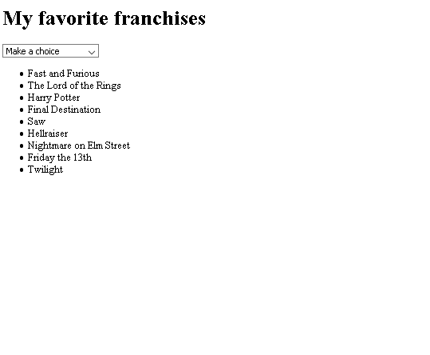

# BeCode Project : "The Kitchen: DOM Events"

This exercice was made by [Jean Fabry](https://github.com/JeanFabry). 
# What was asked ?

We needed to discover the DOM of an HTML file, and adapt it, through several exercises, using only javascript.

Feel free to have a look at the [instructions](https://github.com/becodeorg/bxl-hopper-1-25/tree/master/The%20Hill/the%20kitchen/1.DOM_events).

# What did we learn ?
For this exercise, I learned to use new Javascript methods such as : .
* .InsertBefore
* .childNodes, .children, .firstElementChild
* .nodeType
* .isEqualNode
* .cloneNode

# What did we use ?
*JS

# What does it look like ? 
